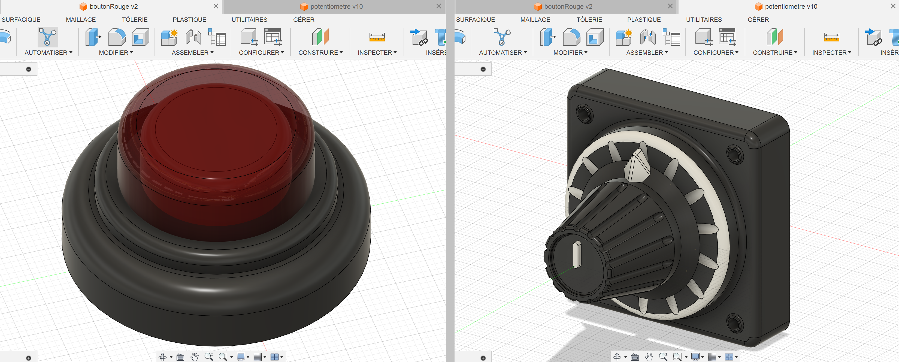

<h1>Dépot workshop Websocket ESP32 - Louis G.</h1>

<h2><ins>Sitemap et sketch (papier) :</ins></h2>

Lien figma :

https://www.figma.com/design/VMiOoXRYvlJWXhNaqHpo8F/CS2-Bader?node-id=0-1&t=VhbxrXciKifTlWeQ-1

<h2><ins>Comment faire ?</ins></h2>

On commence par assembler le circuit suivant :

Dans mon cas j'utilise :
-Un XIAO SEEED ESP32-S3
-Un relais
-Un potentiomètre
-Une led (Built-in dans mon ESP)

1) On installe les "board manager" et "board url" correspondant à son ESP (souvent trouvable sur la datasheet de la board correspondante).

2) On ouvre le code "./pourEsp32" en temps que projet arduino.

3) On modifie les variables "ssid" et "password" avec le nom et le mot de passe de notre réseau wifi local.

4) On tente d'uploader le code sur notre board, en cas d'erreur pour manque de librairie, la librairie "#include <WebSocketsServer.h>" est trouvable sur github et installable en .zip ici : https://github.com/Links2004/arduinoWebSockets

5) Une fois le code uploadé, l'ESP devrait après quelques secondes se connecter avec succès au wifi. En ouvrant le moniteur serial de l'IDE arduino un statue de connexion devrait apparaitre et en cas de succès une IP s'affichera. Ne pas hésiter à utiliser le bouton reset de l'ESP ne parvient à pas à se connecter au wifi pendant un moment (et bien sur verifier le nom et mdp du wifi).

6) On peut ensuite ouvrire la partie "pourVSLiveServer" dans VScode, se rendre à la ligne var socket = new WebSocket("ws://XX.XX.XX.XX:81"); et remplacer les XX par l'adresse IP donnée lors de l'initialisation de l'ESP32. BIEN FAIRE ATTENTION : Il faut laisser le numero de port (:81) comme il est dans le code !!!

7) On peut ensuite lancer notre server local à l'aide de l'extension "Live Server" de VScode. Une page web devrait alors s'ouvrire affichant un bouton rouge. Après avoir cliqué ce dernier on accède à notre panneau de controle. Si tout c'est bien passer on devrait pouvoir controler notre LED et notre relais ainsi que de voir la valeur lu le potentiometre.

<h2><ins>Comment ça marche ?</ins></h2>

Le html sur notre server local et l'ESP communique grâce à un websocket qui constitue un "tunnel" entre les deux. Ils communiquent en s'envoyant des string contenant de l'information. En terme de code l'implementation est vraiment minimal et ne requiert que l'ajout de quelques lignes de code.

<h2><ins>Bonus</ins></h2>

J'ai pour ce projet utilisé deus assets 3D que j'ai modelisé et rendu dans un logiciel de cad, un bouton et un potentiometre.

